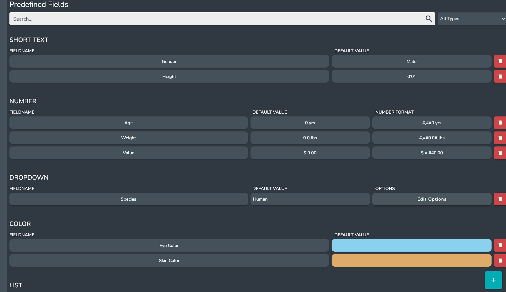

# Custom Fields

## What is a Custom Field

A custom field is a user defined field of a specific field type which can be used across entries. They can be very powerful and a huge time saver.

### Creating Custom Fields

Custom Fields can be created in the *Custom Fields Page* in the settings.

To add a new custom field click the + button in the bottom right hand corner.

Enter a name for the custom field and Select a field Type.

After The custom field has been created it will appear in the list of custom fields.

### Updating Custom Fields

You can update multiple aspects of custom fields on the *Custom fields Page* in the settings including:

* Field Name
* Default Value
* Number Format **(Numbers only)**
* Options **(Dropdown only)**

### Deleting Custom Fields

:::danger

deleting custom fields is not currently supported

:::
