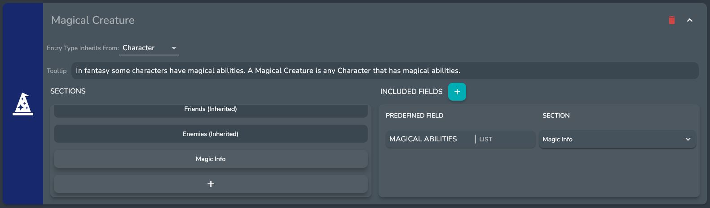
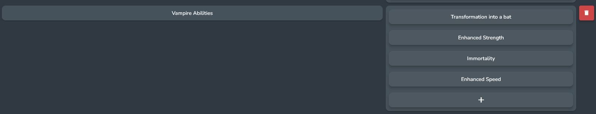
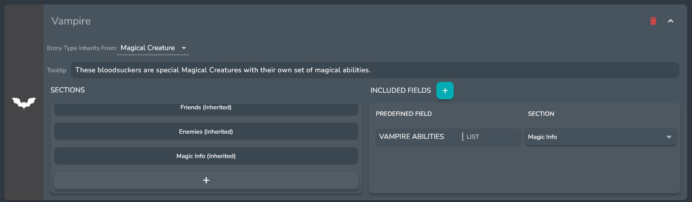
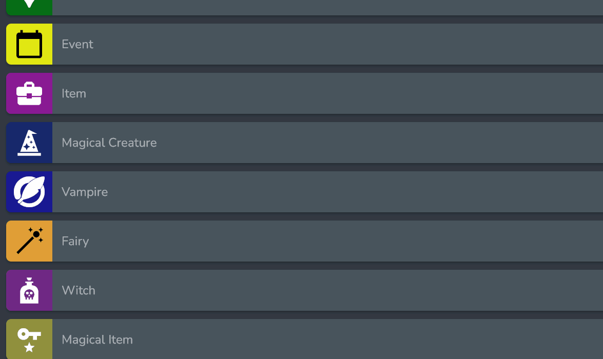
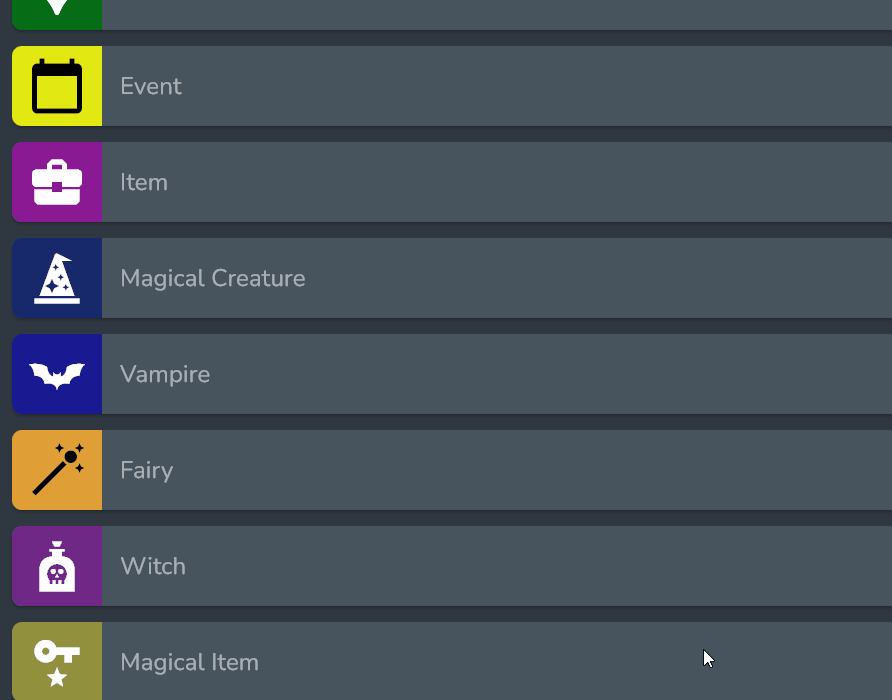
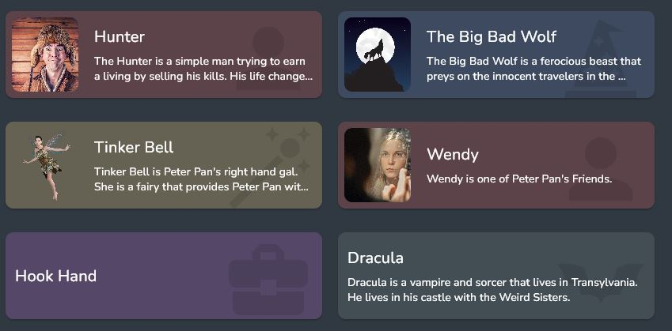
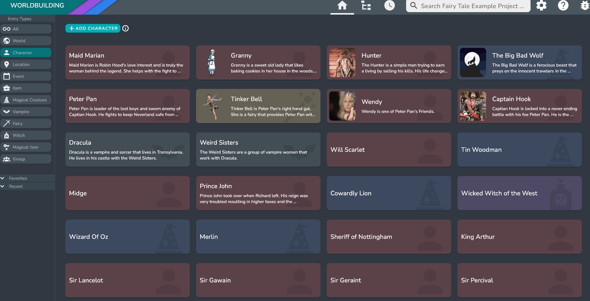

## What is an Entry

An Entry can represent anything in your world or story, from characters, to locations, to items. They hold information via Fields and Sections and can be linked to any other Entry in a given project. 

## Entry Types

Entry Types allow for organization and can serve as templates for future entries. 

Each Entry Type can have predefined Fields and Sections that can be quickly added to an Entry of that type. 

For example, the character entry type, which comes in teh default template, has the following Predefined Fields included:

* Age
* Gender
* Weight
* Eye Color
* Skin Color

Which are all part of a section called Basic Data.

You can edit what Predefined Fields and Sections are included via the Entry Types Menu in the Settings Menu.

## Custom Entry Types

You can also create your own Custom Entry Types.

For example, if you were writing a story with **Magical Creatures** that will all have a *Section* for ***Magic Info*** and a *Predifined Field* for ***Magical Abilities***. As well as the default fields and sections that all **Characters** have.

You could create a Custom Entry Type that inherits from **Character** called **Magical Creature** that has the ***Magic Info*** Section and the ***Magical Abilities*** Predifined Field, and since it inherits from **Character** it will also have all of the fields and Sections that **Characters** have.

You can also inherit from custom entry types. For example say you had a special **Magical Creature** called a **Vampire** that will all have a *Predifined Field* called ***Vampire Abilities***, which has some prefilled in abilities that all **Vampires** have. As well as the default fields and sections that all **Magical Creature** and **Characters** have.

You could first create a [Predefined List Field](../Concepts/predefined_fields) called **Vampire Abilities** with the default abilities that all vampires will have.

You could then create a Custom Entry Type that inherits from **Magical Creature** called **Vampire** that has the ***Vampire Abilities*** Predifined Field, and since it inherits from **Magical Creature** it will also have all of the fields and Sections that **Magical Creature** and **Characters** have.

## Changing Entry Type Icon and Color

You can edit the Icon and color that is associated with each Entry Type by clicking on the Icon in the Entry Type Settings. This will popup a menu to edit either the icon or the color. Select whichever one you want to edit and the appropriate dialog will show up.

:::info

The Icon and color is used throughout Oddisy to indicate the type of an entry, like in the Entry Cards.

:::
:::info

When filtering entries inherted Entry Types will be included in Enrty Types that they inherit from

:::

<!-- ## Aliases

Aliases provide a way to have different versions of the same character. 

An example of this would be if you had a character named *John Becker* who was also a superhero named *ChipmunkMan*. You can create an alias for John Becker called ChipmunkMan and they would be grouped together as aliases.

### Creating Aliases

To create an alias click on the **+** button in the alias bar.

A dialog will appear asking for a name for your alias. 

There is also a number of copying options that you can configure in the dialog:

* Copy Over Description and Sections - *this will copy the description and all of the sections. However, all sections will be empty if the other options are not checked*
* Copy and link all Entry Fields - *this will change all of the entry fields in the current entry to [Synced Fields](#synced-fields) and copy over all of the sections*
* Copy over Entry Links - *this will link the new alias to all of the entries that are linked to the current entry and copy over all of the sections*

:::note

Aliases cannot have the same name. 

:::

### Synced Fields

One of the benefits of Aliases is that you can have synced fields between them.

A synced field will have the same field name and value across all aliases.

You can tell that a field is a synced field if there is a [link] icon next to the field name.

#### Breaking the Link between Synced Fields

You can break the connection between a linked field by right clicking on it and selecting the **Break Link Field Across Aliases** option.

This will keep the field in all of the aliases but the value and name will no longer be synced.

#### Syncing a new field

You can sync any entry field as long as the entry has at least one alias.

To sync a field, simply right click on the field and select the **Link Field Across Aliases** option.

This will add the field to all aliases and sync the field name and value.

:::note

A synced field applies to *every* alias.

:::

### Primary Alias

Whenever there are aliases associated with an entry there will be a primary alias. 

This alias acts as the default alias in other parts of Oddisy. 

The primary alias is indicated by the [crown] icon in the alias bar. 

You can change the primary alias at any time by right clicking on the Alias that you want to be the new primary alias in the alias bar, then selecting the Make Primary Alias option.

 -->