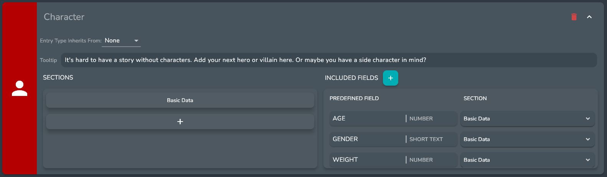

# Entries

## What is an Entry

An entry can represent anything in your world or story, from character to locations to items. They hold information via fields and groups and can be linked to any other entry in a given universe.

## Entry Types

Entry Types allow for organization and entries and can serve as templates for future entries. 

Each Entry Type can have custom fields and groups that get created automatically when an entry of that type is created. 

For instance the built in character entry type has the following custom fields included:

* Age
* Gender
* Weight
* Eye Color
* Skin Color

Which are all part of a group called basic data

You can edit what custom fields and groups are included via the Entry Types Setting Menu

:::tip

You can also create your own Custom Entry Types.

For instance if you were writing a story with a bunch of superheroes you could create a superhero type. Which had custom fields like superpowers, and groups for allies and villains.

:::

## Aliases

Aliases provide a way to have different versions of the same character. 

An example of this might be if you had a character named *John Becker* who was also a superhero named *ChipmunkMan*. You could create an alias for John Becker called ChipmunkMan and they would be grouped together as aliases.

### Creating Aliases

To create an alias click on the **+** button in the alias bar.

A dialog will appear asking for a Name for your Alias. 

There is also a number of copying options that you can configure in the dialog to:

* Copy Over Description and Groups - *this will copy of the description and all of the groups, however the groups will be empty if the other options are not checked*
* Copy and link all Entry Fields - *this will change all of teh entry field in the current entry to [Synced Fields](#synced-fields) and copys over all of the groups*
* Copy over Entry Links - *this will link the new alias to all of the entries that are linked to the current entry and copys over all of the groups*

:::note

Aliases cannot have the same name

:::

### Synced Fields

One of the benefits of Aliases is that you can have synced fields between them.

A sync field will have the same field name and value across all aliases.

You can tell that a field is a synced field if there is a [link] icon next to the field name.

#### Breaking the Link between Synced Fields

You can break the connection between a linked field by right clicking on it and selecting the **Break Link Field Across Aliases** option

This will keep the field in all of the aliases but the value and name will no longer be synced.

#### Syncing a new field

You can sync any entry field as long as the entry has at least one alias.

To sync a field simply right click on the field and select the **Link Field Across Aliases** option

This will add the field to all aliases and sync the field name and value.

### Primary Alias

Whenever there are aliases associated with an entry there will be a primary alias. 

This Alias basically acts as the default alias in other parts of Odissy. 

The Primary Alias is indicated by the [crown] icon in the alias bar. 

You can change the primary alias at any time by right clicking on the Alias that you want to be the new primary Alias in the alias bar and selecting the Make Primary Alias option

