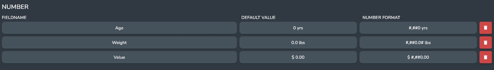
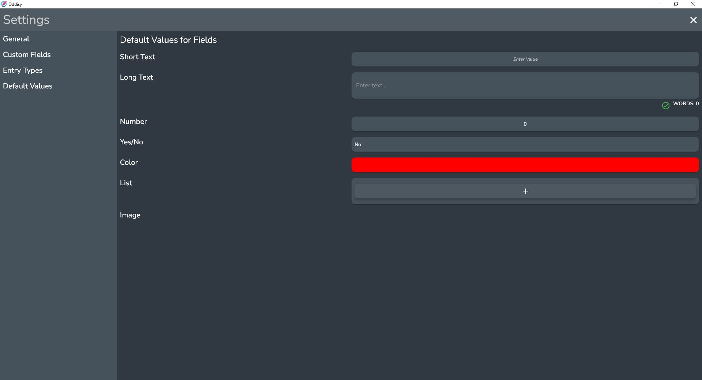

## What is an Entry Field

Entry fields provide a way of storing information about your Entry. 

## Types

### Short Text

The Short Text Field is for names, phrases, or anything else that is less than a short sentence.

### Long Text

The Long Text Field is for anything that is too long for a short text field. This can be backstory, notes, etc.

### Number

The Number Field is for any numerical data. This can be weight, age, or any other value you want to describe using a number.

#### Number Format

The number field displays the number according to a number format.

On Predefined Fields this can be managed in the Settings Menu.

##### Writing Number Format 
The format is specified as a pattern using a subset of the ICU formatting patterns.

* 0 A single digit
* \# A single digit, omitted if the value is zero
* . Decimal separator
* \- Minus sign
* , Grouping separator
* E Separates mantissa and exponent
* \+ \- Before an exponent, to say it should be prefixed with a plus sign.
* % - In prefix or suffix, multiply by 100 and show as percentage
* ‰ (\u2030) In prefix or suffix, multiply by 1000 and show as per mille
* ¤ (\u00A4) Currency sign, replaced by currency name
* ' Used to quote special characters
* ; Used to separate the positive and negative patterns (if both present)

### Yes/No

The Yes/No Field is for anything that is either a yes or no.

### Dropdown

The Dropdown field is for anything that has a set number of possible options.

An example would be Species: Human, Animal, Alien, Robot.

When used in tandem with Predefined Fields, this makes it easy to note the race of different Entries.

:::note 

Dropdowns work best when used as a Predefined Field.

:::

### Color

The Color field is for anything that can be described as a color.

### List

The List Field is for anything that can be represented as a list of Short Text Widgets. 

### Image

An Image field can hold a single image.

## Default Values

You can set the default value for all of the Fields in the Default Values Page in the Settings.

These default values will be used every time you create a new Field of that Predefined Field type.

