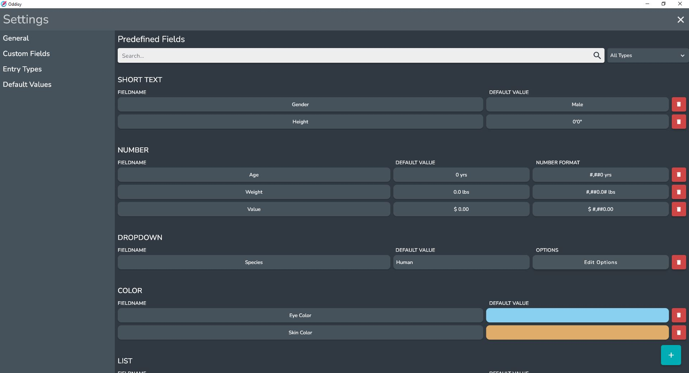
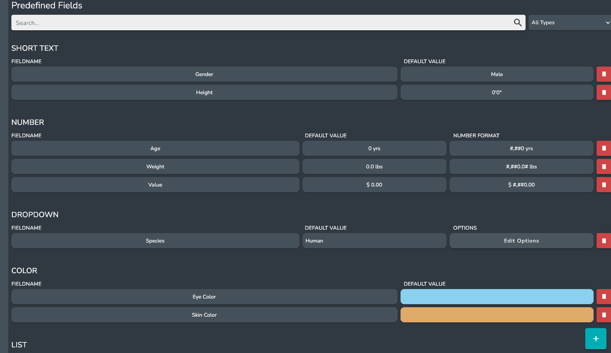

## What is a Predefined Field

A Predefined Field is a user defined Field of a specific Field Type which can be used across Entries. They can be very powerful and can save you lots of time.

### Creating Predefined Fields

Predefined Fields can be created in the *Predefined Fields Page* in the settings.

To add a new Predefined Field click the **+** button in the bottom right hand corner.

Enter a name for the Predefined Field and select a Field Type.

After the Predefined Field has been created it will appear in the list of Predefined Fields.

### Updating Predefined Fields

You can update multiple aspects of Predefined Fields on the *Predefined Fields Page* in the settings:

* Field Name
* Default Value
* Number Format **(Numbers only)**
* Options **(Dropdown only)**

### Deleting Predefined Fields

:::danger

Deleting Predefined Fields is not currently supported.

:::
