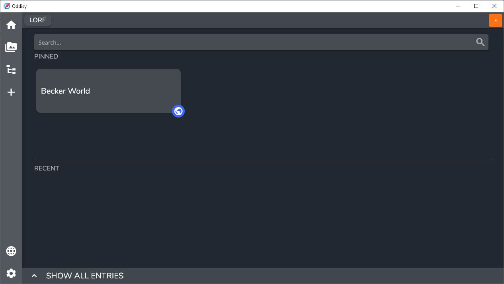
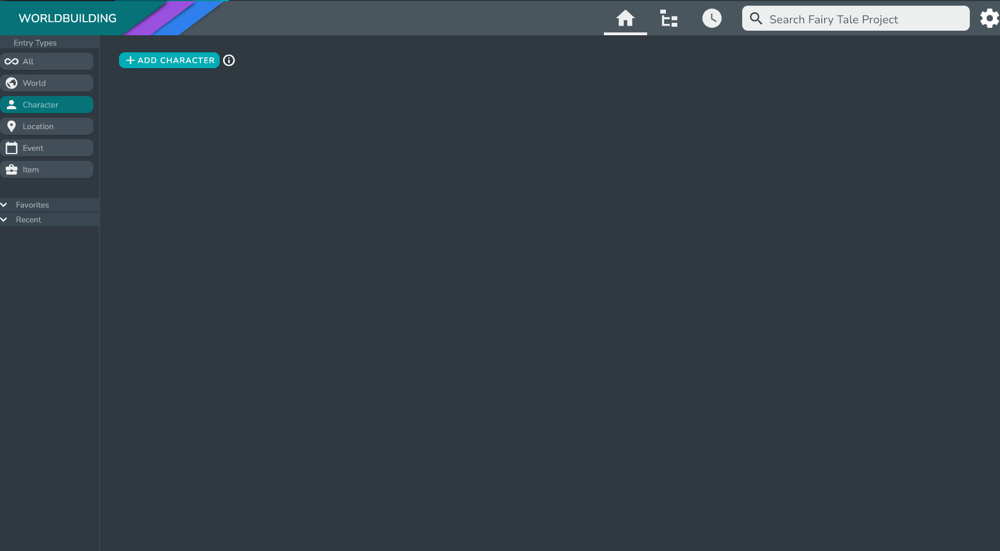
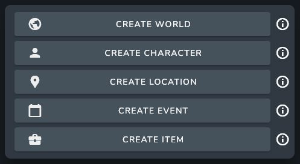
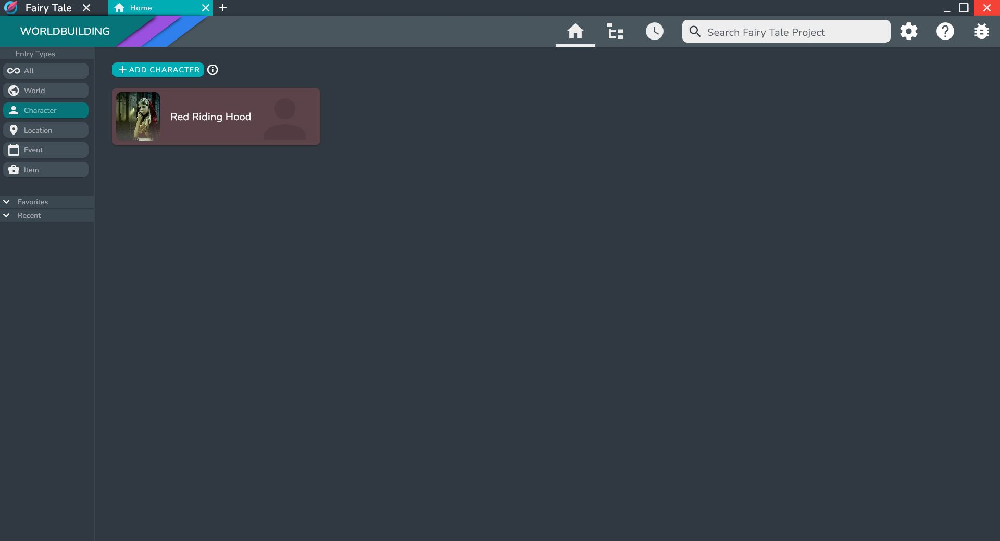

After opening up your newly created Project you will be greeted with the Home Screen. This screen helps you create and view entries by type.
You can also search all of your entries via the search bar at the top of the screen.

:::info

You can switch between the Entry Types via the side bar.

:::

Right now, the only Entry is the World entry that is automatically created when the Project is made. You can view it by switching to the **World** entry type, or by selecting **All** in the Entry Types section of the sidebar.

## Create your First Entry

Let's create a new Character entry to get started. To create a new Character entry, switch to **Character** in the the Entry Types Section of the sidebar, and click on the **ADD CHARACTER** button. 

This will open up the Entry Creation Dialog, which allows you to set the name and add images to the Entry. You will also need to choose a World entry for the new entry to go under. 

:::info

If you have **All** selected in the Entry Types Section of the sidebar and you click the **ADD ENTRY** button, you will be greeted with a dialog that allows you to choose which entry type you want to create.

:::

:::info

Entry Types allow you to organize your entries and also provide the option for reusable templates. For more information on this visit [Entry Types](../Concepts/entries#entry-types).

:::

:::note

When creating a World Entry there will not be the option to add to another World. However, World entries can be linked together in the Entry Page. Simply add the newly created World Entry to any section of your desired Entry.  

:::

:::info

For more information on adding Images, visit [Image Database](../Views_and_Screens/image_database).

:::

After pressing done, your new entry will be created and will appear in the Home Page.

