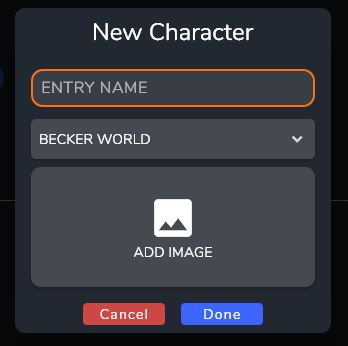

# Creating a New Entry

After opening up your newly created Universe you will be greeted with the Home Screen. This screen displays pinned and recent entries. 
You also can search all of your entries via the search bar at the top of the screen.

Right now the only Entry is the World entry that is automatically created when the Universe is created.

## Create your first Entry

Let's create a new Entry to get started. To create a new entry, click the **+** (Add Entry) button on the side bar. This will open up the Entry Creation Dialog.

First, we need to select an Entry Type. 

:::info

Entry Types allow you to organize your entries and also provide reusable templates that add specific fields during creation. For more information on this visit [Entry Types](../Concepts/entries#entry-types).

:::

After selecting the type, you will see another dialog that allows you to set the name and add images to the Entry. You will also need to choose a World entry for the new entry to go under. 

:::note

When creating a World Entry there will not be the option to add to another World. However, World entries can be linked together in the Entry Page.

:::

:::info

For More information on adding Images, visit [Image Database](../Views_and_Screens/image_database).

:::

After clicking done, your new entry will be created and you will be taken to the Entry Page.

