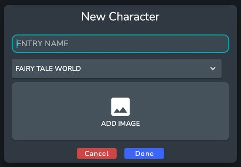

# Creating a New Entry

After opening up your newly created universe you will be greeted with the Home Screen. This screen displays pinned and recent entries. 
You also can search all your entries via the search bar at the top of the screen.

Right now there is only the World entry that was created automatically when we created the universe.

## Create your first Entry

Lets create a new Entry to get started. To create a new entry. Click the **+** (Add Entry) button the side bar. This will open up the Entry Creation Dialog

First we need to select an Entry Type. 

:::info

Entry Types allow you to organize your entries and also provide a way to have reusable templates that add specific fields during creation. For more information on this visit Entry Types   

:::

After selecting the type You will see another dialog that allows you to set the name and add images to the Entry. You will also need to choose a world entry for the new entry to go under. 

:::note

When creating a World Entry there will not be the option to add to another world

:::

:::info

For More information on adding Images visit [Image Database](./creating-a-new-universe)

:::

After clicking done Your new entry will be created and you will be taken to the Entry Page.

