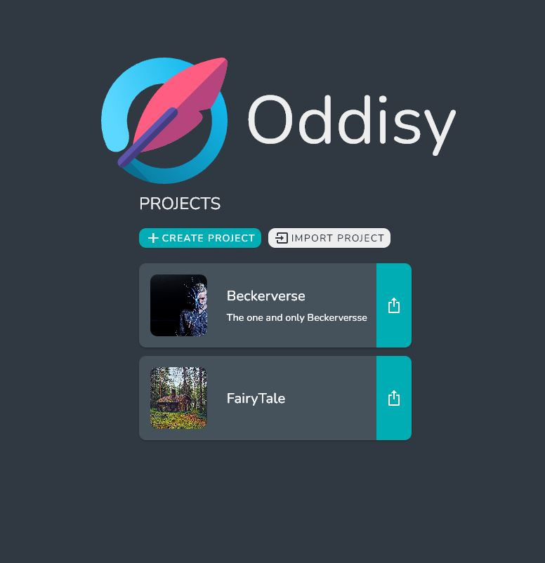
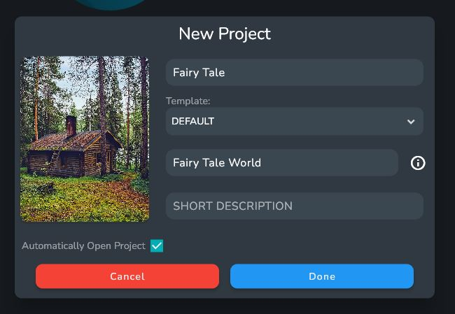

When opening up Oddisy for the first time you will be greeted with the Welcome Page. Here you can open or create new projects.

:::info

Projects in Oddisy hold all of your entries and stories, and can easily be extended to house multiple stories and all of their encompassed entries.

:::

To create a new Project click the Create Project button. 

The dialog will ask for a name for your Project, a name for your default World, a brief description, and an image for your Project.

:::info

When Creating a Project, only the Project name and default World name are required.

:::

:::info

A World is a special Entry that serves as a place to hold and group entries together. It can be used the same as any other Entry, but has a few extra aspects to it. The vast majority of entries will have an associated World entry.

:::

After creating your new Project, Oddisy's Welcome Screen will appear. Click on the Project to open it and begin editing.

