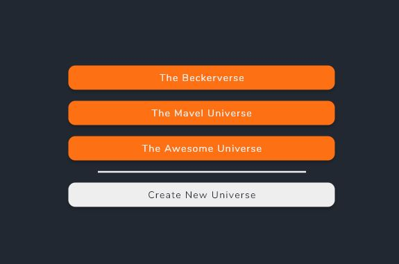
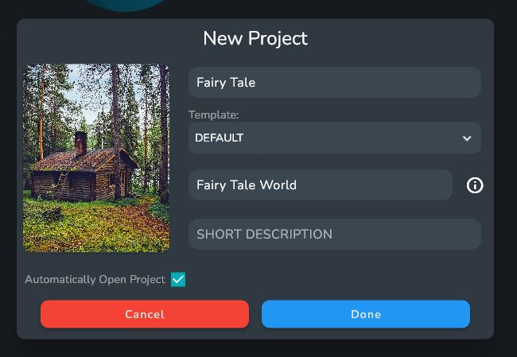
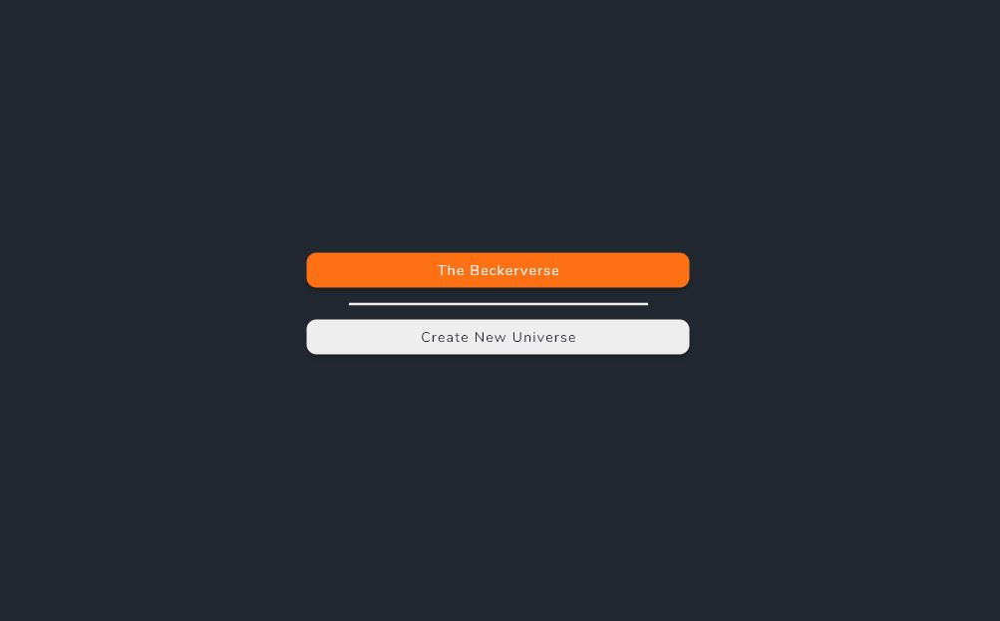

# Creating a New Universe

When opening up Oddisy for the first time you will be greeted with the welcome page. Here you can create new universes and open existing ones

:::info

Universes in Oddisy are basically like projects. They hold all of your entries and stories

:::

To Create a new universe Click the Create New Universe button. 

The dialog will ask for a Name for your Universe and a name for your default World.

:::info

A World is a special Entry that serves as a place to hold and group entries together

:::

After Creating your new Universe it will appear on the welcome Screen 

