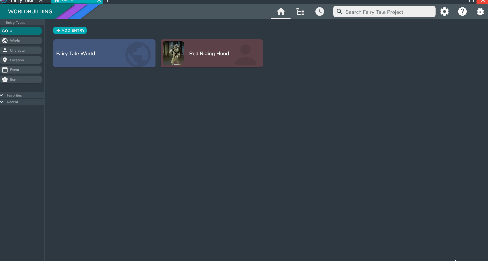
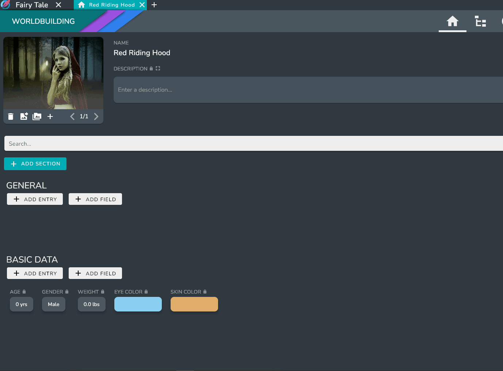

To open an Entry Page simply click on the entry that you wish to open.

The Entry Page is divided into three sections: 
* The Top Bar includes the name of the Entry. You can also delete and favorite the entry via the buttons in the right of the top bar, or navigate back and forward though enrties you have visited using the arrows in the left of the top bar.
* The left section includes the description, images, fields, and linked entries that are organized into **Sections**
* The right section shows all of the entries that are linked to this entry. This makes it easier to find specific Entries without other information fields bogging down your search.

## Adding Fields
You can add Fields to any section by clicking the **ADD FIELD** button under the Section name. A dialog will appear giving you two options: a *Field* or a *Predefined Field*.

:::info

Predefined fields provide a way to create fields that you will use repeatedly. For more info visit [Predefined Fields](../Concepts/predefined_fields) 

:::

Clicking on the standard **Field** option will bring up the Add New Field Dialog which will allow you to choose a Field Type and a Field name.

:::info

For more information on the supported Field Types, visit [Entry Fields](../Concepts/entry_fields).

:::

Once created, the Field will be added to the page and the value and name can be edited at any time.

## Adding Predefined Fields

Predefined Fields provide a way to create Fields that you will use repeatedly. Predefined Fields can have a default value that you set yourself. This makes it easy to add similar information across multiple characters, locations, items, or anything else you can imagine, without having to add information, set the name, or set the Field Type.

You can add a Predefined Field to any section by clicking the **ADD FIELD** button under the Section Name. A dialog will then appear giving you two options: a *Field* or a *Predefined Field*.

Clicking on the standard **Predefined Field** option will bring up the Predefined Field Dialog with all the available Predefined Fields. 

Oddisy comes with some built in Predefined Fields that you can use in your entries immediately. 

:::info

For more information on how to create your own Predefined Fields, visit [Predefined Fields](../Concepts/predefined_fields).

:::

## Adding Sections

Sections provide a way to organize your Fields and Linked Entries.

To add a Section to an entry, click the **ADD SECTION** button at the top of the entry page just below the search bar.

The dialog that pops up will ask for a name for the Section. After you press done, the Section will appear on the Entry Page ready for you to add Fields and Entries to it.

## Linking Entries

To link an entry, use the **LINK ENTRY** button in the *Linked Entries Panel* on the right hand side

This will bring up the Entry Selection dialog. From this dialog you can select entries to add, and even create new entries to add using the **+** button.

All of the entries you select will be visible in the *Linked Entries Panel*. 

:::tip

You can also add entries to any section by using the **ADD ENTRY** button under the Section name. This will link the Entry if it is not already linked, adding it to the Section.

:::
