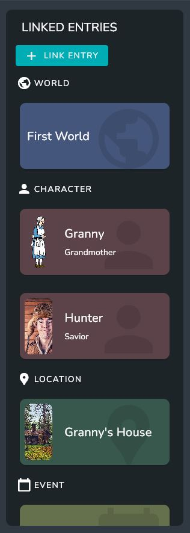

# Filling Out the Entry Page

The Entry Page is divided into 2 sections: 
* The Top Section includes the Name of the Entry, the Description and Images. You can also delete and pin the entry via the buttons in in the top sections 
* The bottom section includes Fields, linked entries, and groups to organize both

## Adding Fields
To add a field Click the **+** add button Next to the fields and groups section.

When the dialog pops-up, click the **Field** option. 

This will popup the Add New Field Dialog which will allow you to choose Field Type and a Field Name.

:::info

For more information on the Supported Field Types visit [Entry Fields](./creating-a-new-universe)

:::

Once created the field will be added to the page and the value and name can be edited at any time

## Adding Custom Fields

Custom Fields provide a way to reuse fields across entries. 

To add a custom field to an entry click the **+** add button Next to the fields and groups section, and when the dialog pops up choose custom field

This will popup the Custom Field Dialog with all the Available custom Fields. 

Odissy comes with some built in custom fields that you can use in your entries. 

:::info

For more information on how to create your own custom fields visit [Custom Fields](./creating-a-new-universe)

:::

## Adding Groups

Groups Provide a Way to organize your Fields and Linked Entries.

To add a group to an entry click the **+** add button Next to the fields and groups section, and when the dialog pops up choose group.

The dialog that pops up will ask for a name for the group.

After Created You can add fields and entries to the groups using the **+** button next to the group name.

## Linking Entries

To link an entry the **+** button next to the group name of the group to want to add the entry to, and select the **Entry** option 

This will bring up the entry selection dialog. From this dialog you can select entries to add and even create new entries to add using the **+** button.

All of the entries you select will be added to the group.

