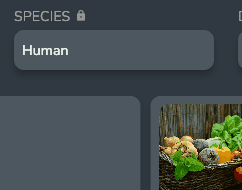

# Entry Page

The Entry Page shows all the information about an entry.

## Image Widget

The Image Widget holds all the images associated with an entry.

### Adding Images

You can add images by clicking on the **+** button in the image widget. This will open up the image picker dialog which allows you to select existing images from the image db and add new from your computer

:::info

For more information on how the image db system works visit [Image Database System](./image_database)

:::

### Deleting Images

You can delete images from the entry using the [trash] button. This will delete from the entry itself but will not delete the image from the database.

### Reordering Images

You can reorder the Images by clicking on the [reorder] button. This will open up the Image reorder dialog.

Simply drag the images in the order that you want them to appear

### Viewing the Image Larger
Clicking on the Image itself will open up a larger version of the image, and allow you to Change the name of the image and even where the image is found on your computer.

## Name and Description Widget

### Name Widget
The Name Widget Allows you to assign a name to your entry, which can be changed at any time.

To change the name simply click on the name, edit it to be the desired name you want, and click the enter key to save.

### Description Widget

The Description field Holds a description of the entry.

The description is automatically saved when editing, with the green checkbox appearing on a successful save.

:::info

A shorter version of the description will appear on entry cards on the home screen

:::

## Editing Field Widgets

### Short Text
Short Text Field Widgets can be edited by clicking on the widget, editing it to be the desired text you want, and clicking the enter key to save.

### Long Text

Long Text Widgets behave like the description field, automatically saving when edited, with the green checkbox appearing on a successful save.

### Number

Number fields can be edited in the same way as text fields, by clicking on the widget, editing the value, and hitting enter to save.

:::info

Numbers are displayed using a number format allowing you to display things such as “25 lbs” or “$15.00”. For more information on how to use this system visit Number Formats

:::

### Yes/No

The Yes/No field can be edited by clicking on the widget and selecting yes or no.

### Dropdown

The Dropdown widget can be edited by clicking on the widget and selecting the desired option.

### Color

The Color widget can be edited by clicking on the widget. This will open up a color picker dialog to choose the desired color.

:::tip

If you know the Hex Value of the desired color you can enter it in the **Hex Value** field at the bottom of the dialog.

:::

### List
You can add items to the list widget by using the **+** button at the bottom of the list. 

The items in the list act like [Short Text Field](#short-text) widgets and can be edited the same way.

To delete items from the list right click on the item that you want to delete and click delete.

### Image

:::danger

This feature is not supported yet

:::

## Editing Field Name

To edit a field Name simply click on the Field Name. This will open up a dialog asking you for the new field name.

## Custom Fields

Custom fields are edited the same way as regular fields. The only difference is that you can not change the Field name. The field name of a custom field is set by the custom field itself which can be edited in the custom field settings. 

For more information visit [Custom Fields](../Concepts/custom_fields)

:::info 

Custom fields are indicated with a lock symbol next the the fieldname

:::

## Adding Fields to Groups

### Adding a New Field to a Group

Click the **+** button next to the Group and select the field option. 

Use the new field dialog to create a field.

### Adding an existing field to a group

Right click on the field that you want to add to a group, and select the add to group option. 

Select the group from the list and click done.

:::tip

You can edit a fields group in the same way by right clicking and selecting the **Move to Group** option instead

:::

## Adding Linked Entry to a Group

### Adding a new Linked Entry to a Group

Click the **+** button next to the Group and select the entry option. 

Use the new entry selection dialog to create new entries or select existing ones.

### Adding an existing Linked Entries to a group

Right click on the Linked Entry that you want to add to a group, and select the add to group option. 

Select all the groups from the list that you want this linked entry to be a part of and click done.

:::tip

You can edit a Linked Entry groups in the same way by selecting the edit groups option instead

:::

## Other Linked Entry Section

Any Linked Entries that are not in a group will appear in the Other Linked Entries Section at the bottom of the page. 

## Editing a Linked Entries Relationship

Each Linked Entry can have a relationship with the entry it is linked to.

This relationship will show up under the name on th linked entry card

To edit a relationship right click on the linked entry card and select the **Edit Relationship** option

This will open up the Relationship dialog. 

You can edit both the Linked Entry’s Relationship to the Current entry and the entry’s relationship to the linked entry. 

## Alias Bar

The Alias bar shows all aliases for the current entry. For more information on what aliases are and how to use them visit [Aliases](../Concepts/entries#aliases)