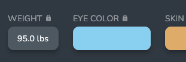
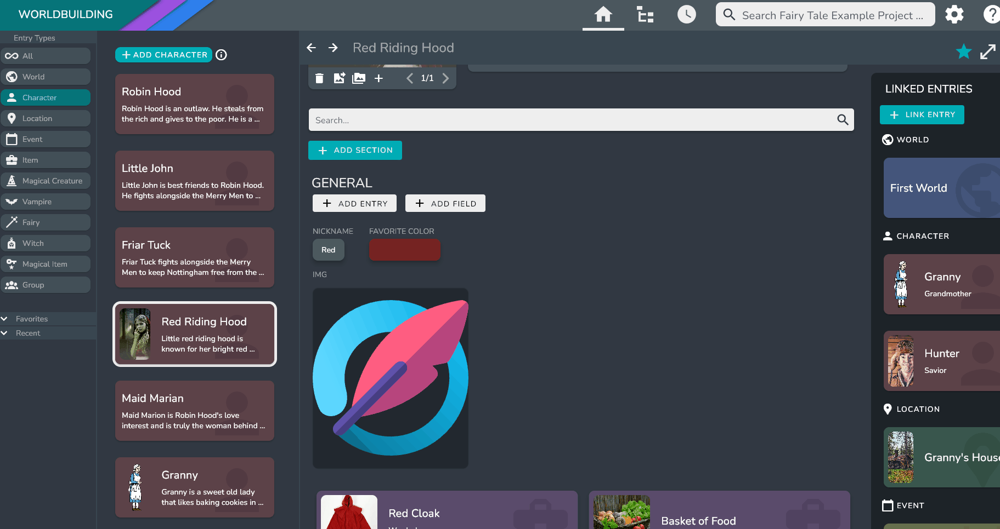
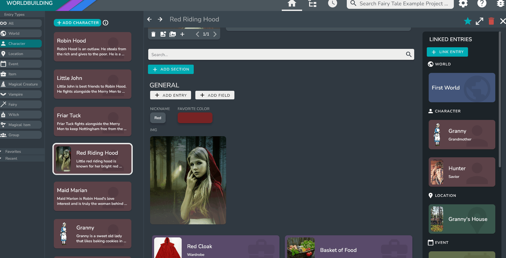
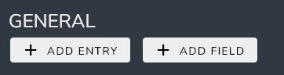
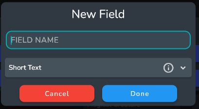
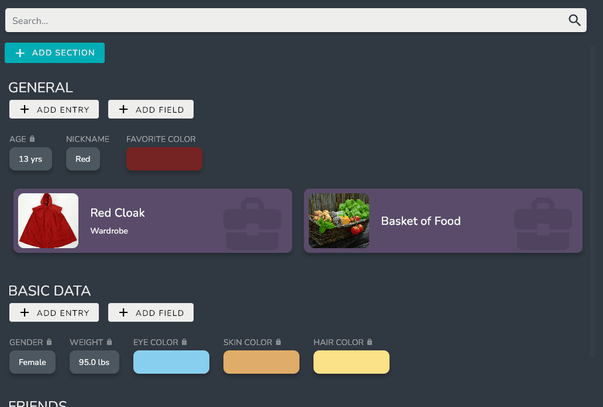
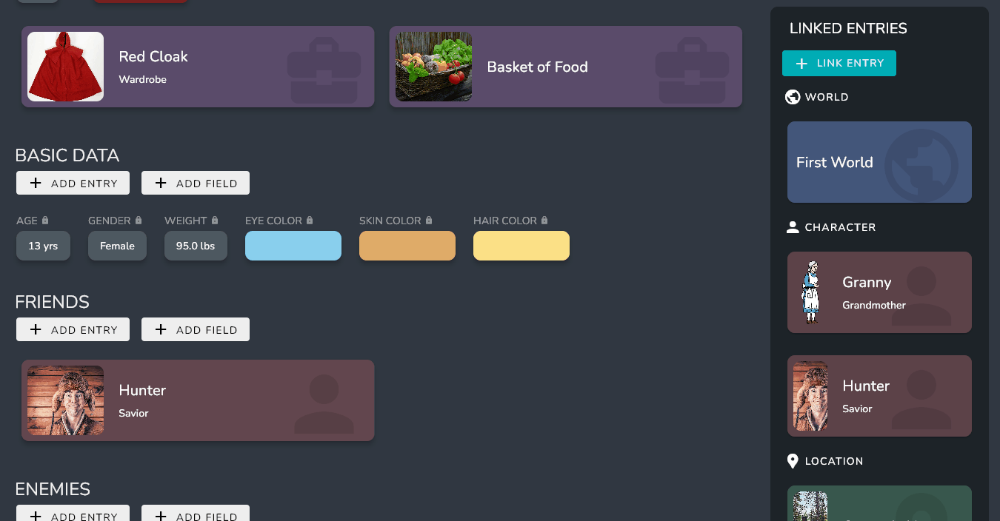
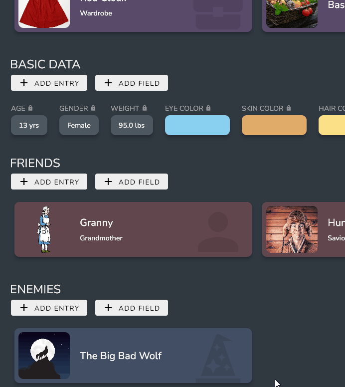

The Entry Page shows all the information of an Entry.

## Image Widget

The Image Widget holds all the images associated with an Entry.

### Adding Images

You can add images by clicking on the **+** button on the image widget. This will open up the Image Picker dialog which allows you to select existing images from the image database and add new images from your computer.

:::info

For more information on how the image database system works, visit [Image Database System](./image_database).

:::

### Deleting Images

You can delete images from the entry using the **trash** button on the image widget. This will delete the image from the entry itself, but will not delete the image from the database.

### Reordering Images

You can reorder the Images by clicking on the [reorder] button. This will open up the Image reorder dialog.

Simply drag the images into the order that you want them to appear. 

### Viewing the Image at a larger size
Clicking on the Image itself will open a larger version of the image, and allow you to change the name of the image in the Image Database and even replace the image in the database with a different image on your computer.

:::note

Replacing the image will overwrite the image in the database. This is mostly used to replace the image with an updated version.

:::

## Name and Description Widget

### Name Widget
The Name Widget allows you to assign a name to your Entry, which can be changed at any time.

To change the name simply click on the name, change it to the desired name, and press the enter key to save.

### Description Widget

The Description Field holds a description of the entry.

The description is automatically saved when editing. You'll know it's been saved successfully when a green checkbox appears.

:::info

A shorter version of the description will appear on Entry Cards on the home screen.

:::

## Editing Field Widgets

### Short Text
Short Text Field Widgets can be edited by clicking on the widget, changing it to the desired text, and pressing the enter key to save.

### Long Text

Long Text Widgets behave like the Description Field, automatically saving when edited. Again, a green checkbox will appear on a successful save.

### Number

Number Fields can be edited in the same way as Text Fields. Click on the widget, edit the value, and hit enter to save.

:::info

Numbers are displayed using a number format allowing you to display things such as “25 lbs” or “$15.00”. For more information on how to use this system, visit [Number Formats](../Concepts/entry_fields#number-format).

:::

### Yes/No

The Yes/No field can be edited by clicking on the widget and selecting yes or no.

### Dropdown

The Dropdown widget can be edited by clicking on the widget and selecting the desired option.

### Color

The Color widget can be edited by clicking on the widget. This will open up a Color Picker Dialog, allowing you to choose your desired color.

:::tip

If you know the hex value of your desired color, you can enter it in the **Hex Value** field at the bottom of the dialog.

:::

### List
You can add items to the List widget by using the **+** button at the bottom of the list. 

The items in the list act like [Short Text Field](#short-text) widgets and can be edited in the same way.

To delete items from the list, right click on the item that you want to delete, then click delete.

### Image

The Image Widget can hold one image. When first inserting the image widget you can select an image by clicking on the Image Widget.

This will open up the Image Picker Dialog. 

You can view a full version of the Image by clicking on the image widget.

:::tip

You can also switch the image out from the fullscreen viewer.

:::

## Editing Field Name

To edit a Field name, simply click on the Field Name. This will open up a dialog asking you for the new Field name.

## Predefined Fields

Predefined Fields are edited the same way as regular fields. The only difference is that you cannot change the Field name. The Field name of a Predefined field is set by the Predefined Field itself, which can be edited in the Predefined Field settings in the Settings Menu. 

For more information, visit [Custom Fields](../Concepts/predefined_fields).

:::info 

Predefined Fields are indicated with a lock symbol next the the Field name.

:::

## Adding Fields to Sections

### Adding a New Field to a Section

Click the **ADD FIELD** button under the Section and select the Field option. 

Use the New Field Dialog to create a field.

### Adding an existing Field to a Section

Right click on the field that you want to add to a Section, and select the **Move to Section** option. 

Select the Section from the list and click done.

## Adding Linked Entries to a Section

### Adding a new Linked Entry to a Section

Click the **ADD ENTRY** button under the Section and select the Field option. 

Use the New Entry Selection dialog to create new Entries or select existing ones.

### Adding an existing Linked Entries to a Section

Right click on the Linked Entry that you want to add to a Section, then select the add to Section option. 

Select all the Sections from the list that you want this Linked Entry to be part of, then click done.

:::tip

You can edit a Linked Entry in the same way by selecting the Edit Sections option instead.

:::

## Linked Entry Section

All Entries that a linked to the current Entry will appear in the Linked Entries Section on the right hand side of the page, and will be organized by their Entry Type.

## Editing a Linked Entries Relationship

Each Linked Entry can have a relationship with the Entry linked to it.

This relationship will show up under the name on the Linked Entry card.

To edit a relationship, right click on the linked entry card and select the **Edit Relationship** option.

This will open up the Relationship dialog. 

You can edit both the Linked Entry’s Relationship to the Current entry, and the Entry’s relationship to the Linked Entry. 

<!-- ## Alias Bar

The Alias bar shows all aliases for the current entry. For more information on what aliases are and how to use them, visit [Aliases](../Concepts/entries#aliases). -->