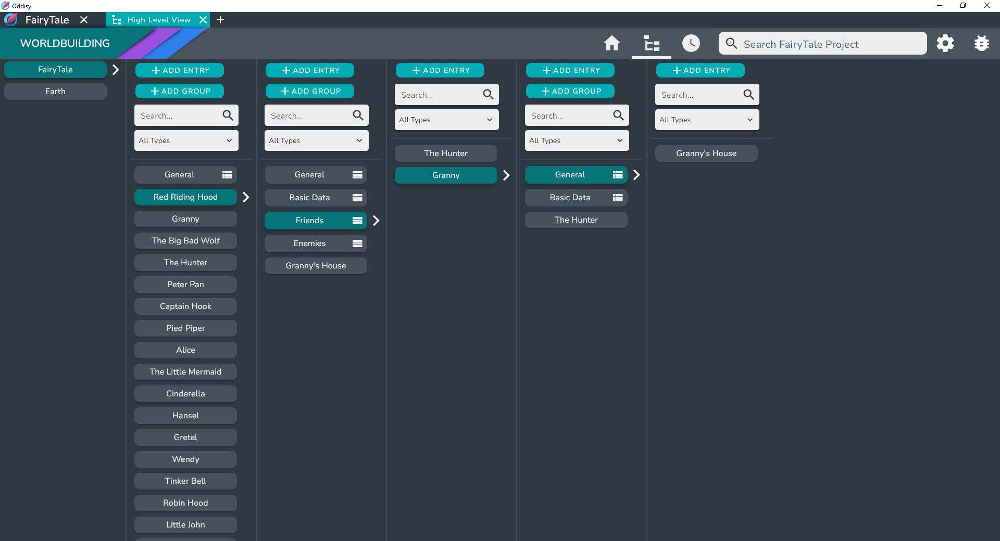
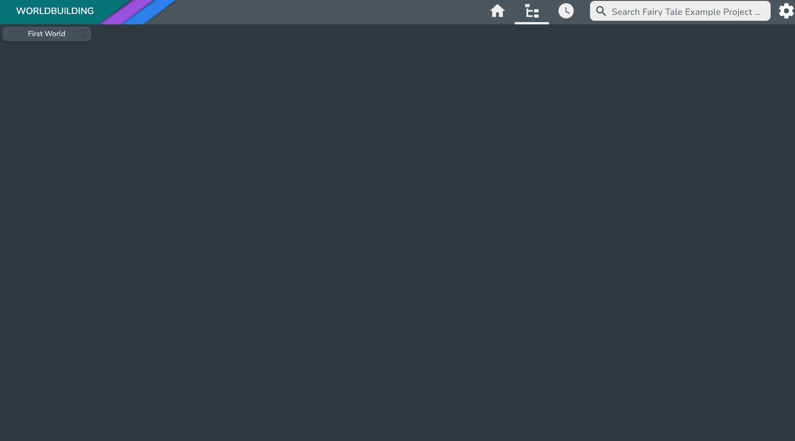
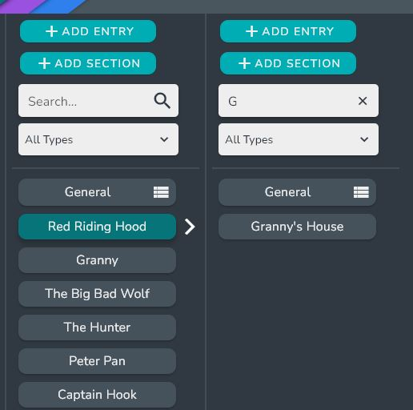
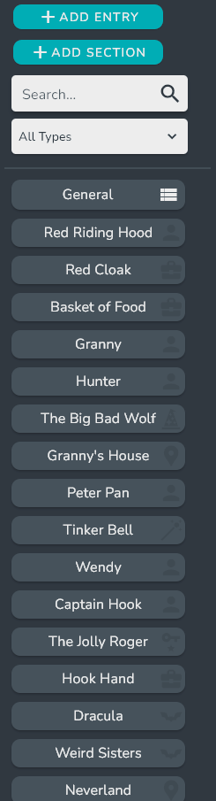
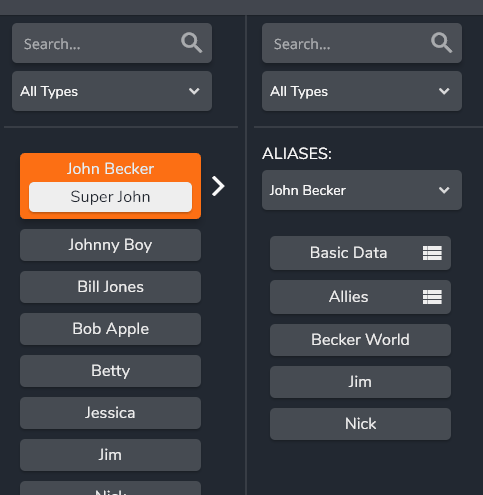
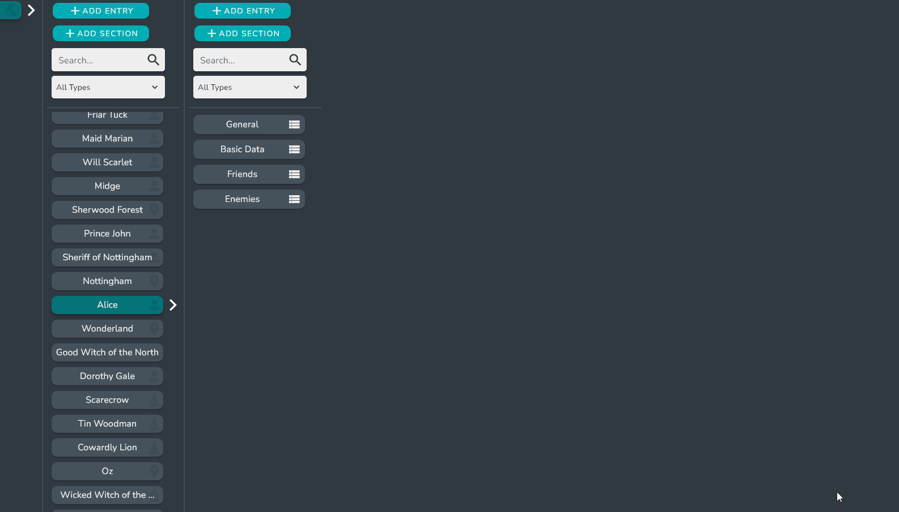
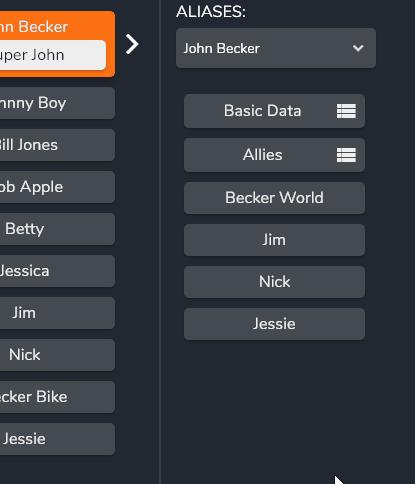

The High Level View allows you to navigate through all of the interconnections of your world quickly.

:::tip

The High Level View also serves as a quick way to link entries and organize multiple entries into Sections.

:::

## Navigating 

### Basic Navigation

To Navigate the High Level View, simply select a High Level Entry card. This will open the Sections and entries that are contained in the selected Entry.

### Searching and filtering

Within each entry, you can search via the search bar to find the entry or Sections you are looking for.

You can also filter the entries by a specific entry type. 

<!-- ### Alias selection

If the Entry has an alias, you can switch between them using the alias dropdown.

 -->

## Linking Entries

To link an entry, simply click the **ADD ENTRY** button in the column of the entry or the Section you want to link the entry with.

This will open up the Entry Selection dialog where you can select entries or create new entries.

:::tip

You can also link entries by right clicking inside the entry or the Section you want to link the entry with, then select the **Add Entry** option.

:::

## Adding Sections

To add a Sections to an entry, simply **ADD GROUP** button in the column of the entry or the Section you want to create a new section in.

A dialog asking for the Sections name will pop up. Enter the name and click done.

:::tip

You can also link entries by right clicking inside the entry or the Section you want to link the entry with, then select the **Add Group** option. 

:::