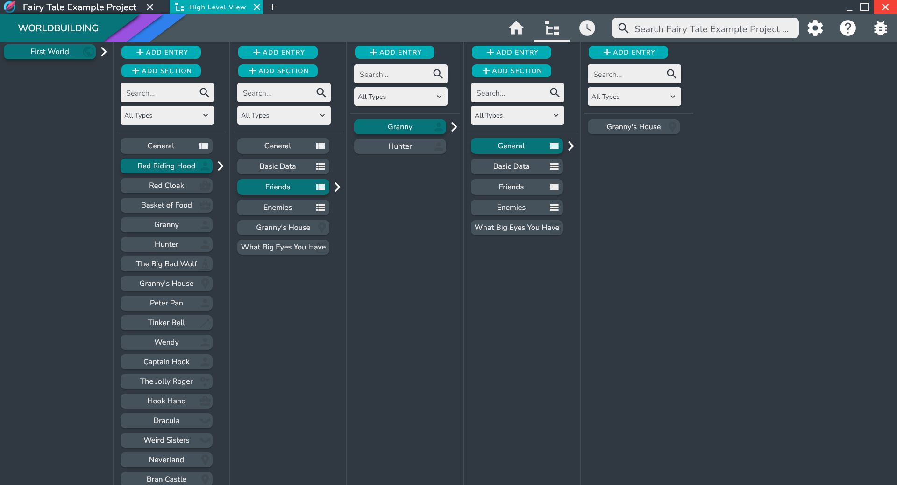

# High Level View

The High Level View allows you to navigate through all of the interconnection of your world quickly.

:::tip

The High Level View also provides a quick way to link a bunch of entries quickly and organize them into groups.

:::

## Navigating 

### Basic Navigation

To Navigate the high level view simply select a high level entry card. This will open up the groups and entries that are contained in the selected Entry

### Searching and filtering

Within each entry, you can search via the search bar to find the entry or group you are looking for.

You can also filter the entries by a specific entry type. 

### Alias selection

If the Entry has an Alias you can switch between them using the alias dropdown.

## Linking Entries

To link an entry simply right click inside the entry or the group to want to link the entry to and select the **Add Entry** option.

This will open up the Entry Selection dialog where you can select entries or create new entries.

## Adding Groups

To add a group to an entry simply right click inside the entry you want to add the group to and select the Add Group option. 

A dialog asking for the group name will pop up. Enter the name and click done.

