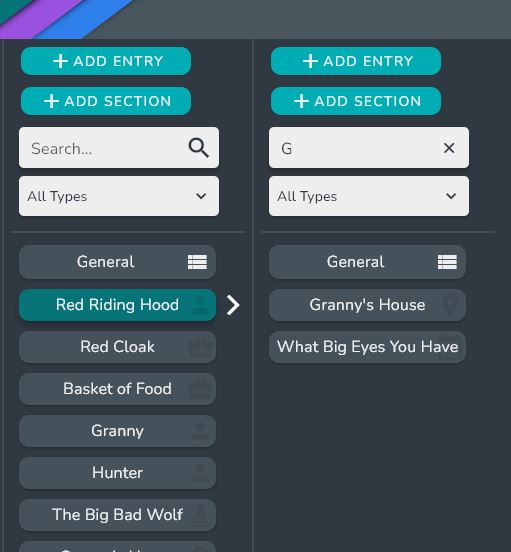

# High Level View

The High Level View allows you to navigate through all of the interconnections of your world quickly.

:::tip

The High Level View also serves as a quick way to link entries and organize multiple entries into groups.

:::

## Navigating 

### Basic Navigation

To Navigate the High Level View, simply select a High Level Entry card. This will open the groups and entries that are contained in the selected Entry.

### Searching and filtering

Within each entry, you can search via the search bar to find the entry or group you are looking for.

You can also filter the entries by a specific entry type. 

### Alias selection

If the Entry has an alias, you can switch between them using the alias dropdown.

## Linking Entries

To link an entry, simply right click inside the entry or the group you want to link the entry with, then select the **Add Entry** option.

This will open up the Entry Selection dialog where you can select entries or create new entries.

## Adding Groups

To add a Group to an entry, simply right click inside the entry you want to add the group to, then select the Add Group option. 

A dialog asking for the Group name will pop up. Enter the name and click done.

