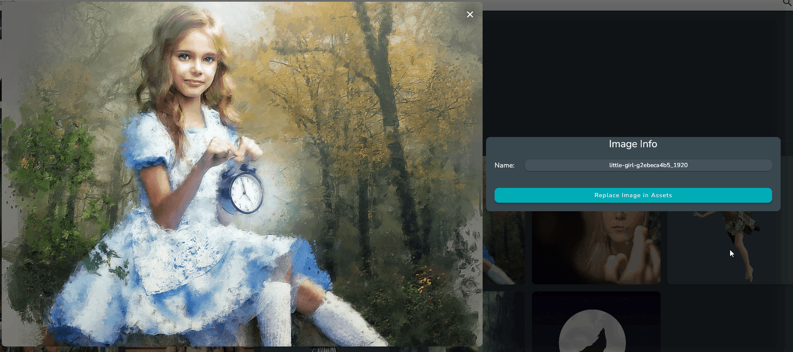

# Image Database

The image database is where all of your images are stored and organized.

* The Image Bar - This will show a scrollable bar of images and can be set to show all images or only unorganized images.
* The Collections Section - This section shows all the collections and images that are in the selected collections

## What are Collections

Collections provide a way to organize your images. They function similarly to folders. 

Collections can store both images and other collections.

:::tip

Unlike the way normal folders work, Images can be stored in multiple collections at the same time, all referencing the same Image.

:::

## Adding Images

To add an image, click on the add button in the bottom right hand corner and select the **Image** option, or right click and select the Add Image option.

If you are in a collection this will open up the Image Picker Dialog, which will allow you to add existing images from the Image Database, or new images from your computer.

If you are not in a collection, this will open up a file dialog allowing you to add new images from your computer.

## Adding Collections

To add a collection, click on the add button in the bottom right hand corner and select the Collection option or right click and select the **Add Collection** option.

This will popup a dialog asking for the collection name. Enter the name and click done.

## Adding Images to Collections

Images can be added to collections two ways

* Click on the add button in the bottom right hand corner, then select the Image option, or right click and select the Add Image option. 
This will open up the Image Picker Dialog, which will allow you to add existing images from the Image Database, or new images from your computer.

* Drag and drop images from the Image bar into the desired collection.

## Searching the Image Database

The search bar at the top of the screen allows you to search through all your images and collections.

## Renaming An Image

To rename an image, click on the image you want to rename. This will open up the larger view of the image.

From here you can edit the name from the Image Name field.

## Relinking an Image

Sometimes an image needs to be relinked. This means you have moved the location of the image on your computer, or you have a new version of the image that you want to replace it with.

To relink the image, click on the image you want to relink. This will open up the larger view of the image. 

From here, you can click on the Image Path field and it will open a dialog allowing you to select the new image file or file location.

